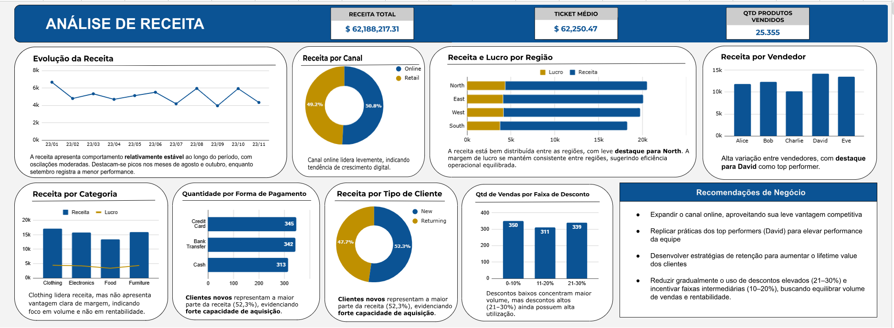
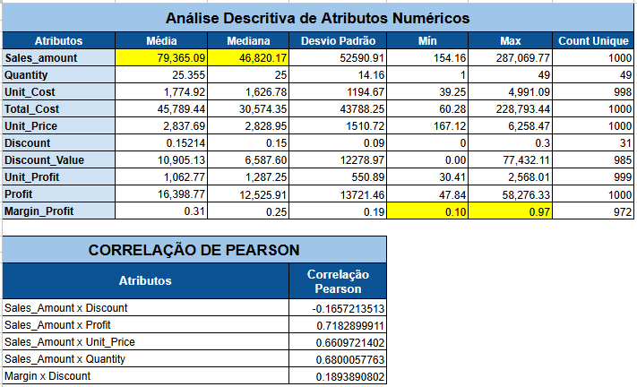

# 📊 EDA de Vendas | Google Sheets

## 🔍 Visão Geral

Este projeto tem como objetivo realizar uma Análise Exploratória de Dados (EDA) em um dataset de vendas, com foco em identificar os principais drivers de receita, lucro e eficiência comercial.

A análise foi desenvolvida utilizando Google Sheets, com construção de métricas, análises estatísticas e um dashboard final para suporte à tomada de decisão.

---

## ⚠️ Problema Identificado

Durante a análise, foi identificada uma inconsistência na variável **Sales_Amount**, que não seguia a lógica esperada de negócio.

---

## ✅ Solução Aplicada

A métrica de receita foi reconstruída com base na seguinte fórmula:

```
Sales_Amount = (Unit_Price * Quantity) * (1 - Discount)
```

Além disso, foram criadas novas métricas:

* Custo total
* Lucro
* Margem de lucro
* Faixa de desconto

---

## 🛠️ Etapas do Projeto

* Limpeza e transformação dos dados
* Criação de variáveis derivadas
* Análise descritiva
* Análise de correlação (Pearson)
* Identificação de outliers
* Construção de dashboard

---

## 📊 Principais Insights

* 📉 Descontos não apresentam impacto positivo relevante na receita
* 📦 Receita é fortemente influenciada pelo volume de vendas
* 💰 Receita e lucro crescem juntos (crescimento saudável)
* ⚠️ Alta variabilidade indica dependência de grandes vendas
* 📊 Margem apresenta inconsistência entre produtos

---

## 📌 Recomendações de Negócio

* Padronização de margem dos produtos.
* Revisar política de precificação dos produtos.
* Focar em aumento de volume (cross-sell / up-sell).
* Desenvolver estratégias de retenção de clientes.
* Replicar padrões de vendas de alto valor.

---

## 📷 Dashboard

### Análise de Receita



### Análise Descritiva



---

## 📂 Estrutura do Projeto

```
data/ → bases de dados  
dashboard/ → prints principais  
images/ → imagens auxiliares  
```

---

## 🔗 Acesse o Projeto no Google Sheets

[[Link para o Google Sheets](https://docs.google.com/spreadsheets/d/18iX8m1M2CBlbTnjS9FXWRurJgpA8v2KL3ak26OjFr_4/edit?usp=sharing)]

---

## 🧠 Tecnologias Utilizadas

* Google Sheets
* Tabelas Dinâmicas
* Funções analíticas
* Visualização de dados

---

## 👤 Autor

Felipe Galindo
